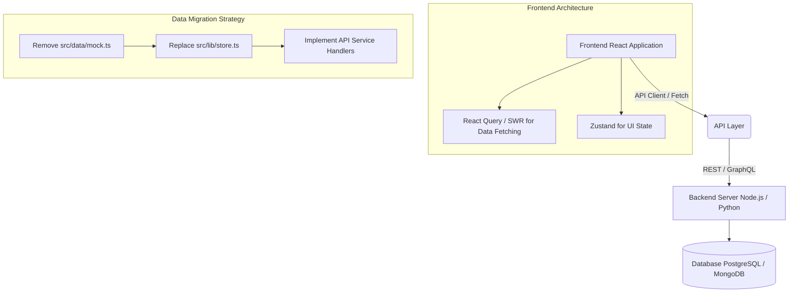

# Backend Integration Roadmap

This roadmap details the complete architecture for migrating the Saravana Traders CRM from local, mock-based data to a fully connected backend.

## 1. Architectural Overview (Mind Map)



## 2. Current State vs. Future State

**Current State:**
- Data is statically defined in `src/data/mock.ts`.
- The application uses `src/lib/store.ts` (via `useSyncExternalStore` or similar) to manage state and fake CRUD operations.
- All relationships (e.g., an Order's Employee) are resolved client-side.

**Future State:**
- Data will be fetched asynchronously using API endpoints.
- `src/lib/store.ts` will only handle pure UI state (like active tabs, mobile menus, or theming).
- Data fetching and caching will be handled by a library like `@tanstack/react-query` or `swr`.
- CRUD operations will become HTTP POST/PUT/DELETE requests.

## 3. Targeted Alteration Areas

The following files need to be explicitly modified or removed during the backend transition:

### [DELETE] `src/data/mock.ts`
- **Why:** Contains all hardcoded `customers`, `employees`, `leads`, `orders`, and `followUps`.
- **Action:** Delete this file entirely once API endpoints are ready.

### [MODIFY] `src/lib/store.ts`
- **Why:** Currently acts as the mock database, containing functions like `crm.addOrder`, `crm.updateLead`, and `crm.deleteCustomer`.
- **Action:**
  1. Remove all mock data imports.
  2. Remove all CRUD functions.
  3. Keep only necessary global UI state (if any).
  4. Migrate the data-store logic to a dedicated API client folder (e.g., `src/api/`).

### [MODIFY] `src/types/index.ts`
- **Why:** Contains the TypeScript definitions for the data models.
- **Action:**
  - Update interfaces to match the exact schema returned by the backend.
  - Add standard database fields like `id` (UUID), `created_at`, `updated_at`, `deleted_at`.

### [MODIFY] All Route Components (`src/routes/*.tsx`)
- **Why:** Currently calling `const { customers, orders } = useCrm();` to get data synchronously.
- **Action:** Replace synchronous store hooks with asynchronous fetching hooks.
  
**Example Transformation:**
*Before:*
```tsx
const { orders } = useCrm();
const myOrders = orders.filter(o => o.employeeId === user.id);
```
*After:*
```tsx
const { data: myOrders, isLoading } = useQuery(['orders', { employeeId: user.id }], fetchOrders);
if (isLoading) return <LoadingSpinner />;
```

## 4. Required API Endpoints

To support the exact functionality currently mocked in the app, the backend must provide the following endpoints:

### Authentication & Employees
- `POST /api/auth/login` - Authenticate users
- `GET /api/employees` - List all employees (for admin assignment/filters)
- `GET /api/employees/:id` - Get employee profile and workload

### Leads & Customers
- `GET /api/leads` - List leads with filters (status, employeeId)
- `POST /api/leads` - Create a new lead
- `PUT /api/leads/:id` - Update a lead (status, details)
- `GET /api/customers` - List customers
- `POST /api/customers` - Convert lead to customer / create customer
- `GET /api/customers/:id` - Get customer details, history, and timeline

### Orders
- `GET /api/orders` - List all orders
- `POST /api/orders` - Create a new order
- `GET /api/orders/:id` - Order details
- `PUT /api/orders/:id` - Update order status (Pending -> Processing -> Delivered)

### Follow-ups & Calendar
- `GET /api/follow-ups` - List follow-ups with date range filters (for Calendar)
- `POST /api/follow-ups` - Schedule a new follow-up
- `PUT /api/follow-ups/:id` - Mark as completed or reschedule

## 5. Execution Strategy

1. **Phase 1: API Client Setup:** Install `axios` and `@tanstack/react-query`. Create `src/api/client.ts`.
2. **Phase 2: Hybrid Mode:** Keep `mock.ts` but access it through asynchronous functions mimicking `axios` calls (`delay(500)`).
3. **Phase 3: Component Migration:** Migrate route components one by one to use the async hooks.
4. **Phase 4: Backend Cut-over:** Swap the fake async functions for real `axios` calls to the live backend. Delete `mock.ts`.
